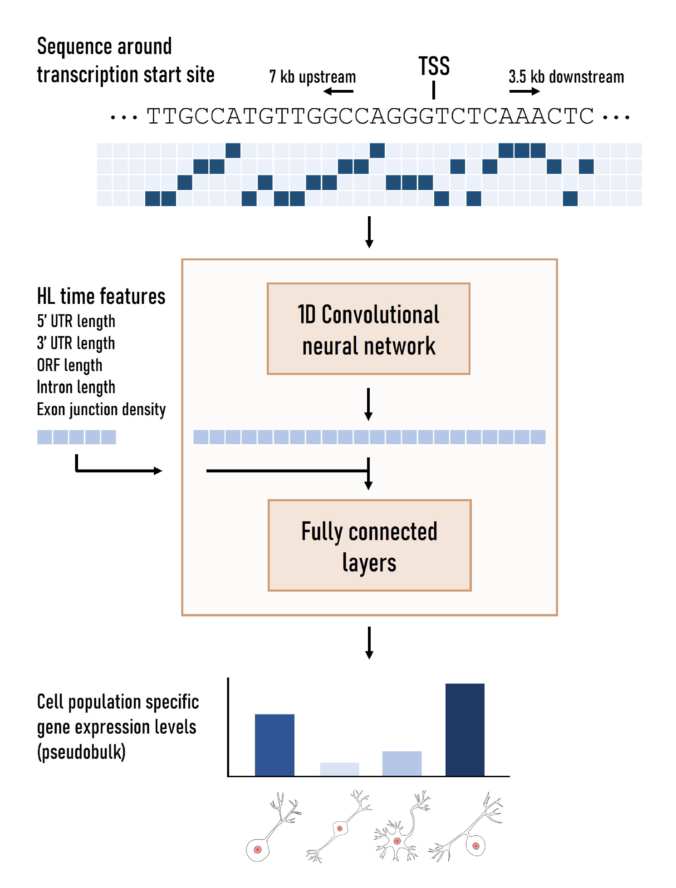

# scEP - predicting cell population-specific gene expression levels

We present scEP: a method that predicts gene expression at an unprecedented resolution using single-cell RNA-sequencing data. Using this GitHub, you can reproduce the figures from the preprint **add link**, train your own models, or look at the predicted effect of interesting variants. 

The results, trained models, input sequences etc. can all be downloaded from Zenodo (**add link**).

### Code
This folder contains the code to train your own models. Python version 3.6 or higher and PyTorch version 1.9 or higher is required for this.

### Tutorials
Here, we explain step-by-step how to train your own models and look at interesting variants or apply in-silico mutagenesis.

1. [Creating your own pseudobulk values](https://github.com/lcmmichielsen/scEP/blob/main/tutorials/1.%20Creating%20your%20own%20pseudobulk%20expression.ipynb)
2. [Training scEP models](https://github.com/lcmmichielsen/scEP/blob/main/tutorials/2.%20Training%20the%20models.ipynb)
3. [Evaluating the performance](https://github.com/lcmmichielsen/scEP/blob/main/tutorials/3.%20Evaluating%20the%20performance.ipynb)
4. [In-silico mutagenesis](https://github.com/lcmmichielsen/scEP/blob/main/tutorials/4.%20In-silico%20mutagenesis.ipynb)
5. [Looking at individual variants](https://github.com/lcmmichielsen/scEP/blob/main/tutorials/5.%20Looking%20at%20individual%20variants.ipynb)

### Figures
Contains Jupyter Notebooks to reproduce all the figures from the preprint. 

